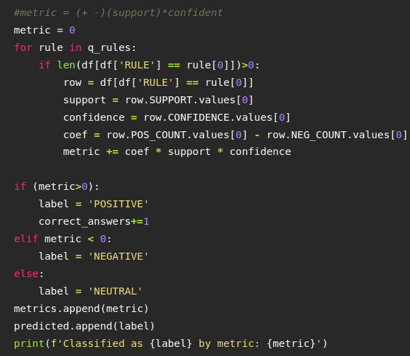

# Sentimental Classifying Tweets using a Rule Based Classifier
Although Semantic analysis of tweets is a well-known application for **Natural Language Processing(NLP)**, using a Rule-Based Classifier to do this task was a new adventure for me. This repository contains two notebooks `Phase-1` and `Rule Based Classifier` which are described in the following:

In Phase-1 the MapReduce model is implemented using a class written by myself, but in the Rule Based Classifier, we used **Spark** implementation of the MapReduce programming model using the **pyspark library**.

### The WorkFlow
In the first step, we extracted rules for pair of words from presented tweets in our corpus and calculated their Support and Confidence. MapReduce is the programming model used to implement the rule extraction phase. After obtaining the list of rules with the corresponding Support and Confidence, we calculated the frequency of these rules in positive and negative tweets which enables us to define a metric to classify the tweets semantically.

### The Metric
Below there is the implementation of the proposed metric

### The Evaluation:
Our Rule Based Classifier obtained ~48% accuracy on 20% of data that used for the testing phase which demonstrates a huge room for improvement.